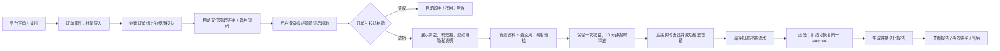

# AI 面签商业流程审计

审计日期：2026-07-23  
审计对象：抖音 / 小红书购买后，通过兑换权益完成 AI 面签并生成报告的概念流程  
用户目标：付款后无需人工来回沟通，稳定完成一次已购买的 AI 面签并拿到可再次查看的报告

## 总体结论

方向是对的：购买与使用权益分离、服务端验证、上游连接成功后再扣减，已经具备商业化的基本骨架。但当前流程仍是“人工发货 + 兑换码即权益 + 连接成功即扣费”，流量增加后会在客服交付、误扣次数、多人共用、售后举证和订单对账上同时失控。

正式版应把兑换码降级为领取凭证，真正的商品是绑定订单和用户的 `entitlement`（使用权益），并用不可篡改的用量流水完成扣减、恢复和退款对账。

## 当前步骤与健康度

| 步骤 | 当前动作 | 健康度 | 主要问题 |
|---|---|---|---|
| 1 | 用户在抖音 / 小红书购买 | 需补强 | 商品页必须明确次数、有效期、支持签证类型、报告内容、退款条件和“非官方签证服务”免责声明。 |
| 2 | 客服发送网址和兑换码 | 高风险 | 人工交付不可规模化，易漏发、错发、晚发，也无法稳定归因订单与渠道。优先改成平台允许的自动发货或订单事件自动创建权益。 |
| 3 | 用户在网页输入兑换码 | 可优化 | 应支持复制粘贴、自动去空格和大小写；更理想是链接内含一次性领取令牌，用户点击后自动领取。 |
| 4 | 服务器验证 | 需重构 | 不能只判断“码是否存在”，还要核验订单已支付、未退款、商品 SKU、有效期、领取人、剩余次数与风险状态。 |
| 5 | 无效或已使用后联系客服 | 高风险 | 所有失败都丢给客服会放大成本。页面要区分无效、过期、已领取、次数用尽、订单退款、系统繁忙，并给出对应自助动作。 |
| 6 | 有效后暂时锁定兑换码 | 好概念，定义不足 | 必须说明锁定对象、锁定时长、续期、超时释放和并发规则。建议 10 分钟 TTL，并使用数据库事务或唯一约束防止双重占用。 |
| 7 | 选择面签官并填写背景 | 需补强 | 在扣减前增加设备、麦克风、网络和服务健康检查；背景资料应自动保存并遵循最小必要原则。 |
| 8 | 实时语音连接成功 | 需补强 | “WebSocket 打开”不等于用户已经获得服务。还应确认麦克风权限、音频可播放、首个 AI 问题成功送达。 |
| 9 | 兑换码正式消耗 | 高风险 | 不应直接改兑换码本身，而应新增一条幂等的权益流水；建议在首个问题成功播放后提交扣减。同一 `attempt_id` 重连不得重复扣减。 |
| 10 | 完成面签 | 需补强 | 中断后要能恢复同一场；用户主动退出、网络失败、上游故障、超时应采用不同的扣减 / 恢复政策。 |
| 11 | 生成同一次面签报告 | 需补强 | 报告要持久化并进入“我的报告”，生成失败应自动重试且不额外扣次，用户无需保持页面打开。 |

## 推荐流程

## 建议的权益状态机

`issued → claimed → available → reserved → in_progress → consumed → completed`

异常状态：

- `expired`：超过有效期，不允许新面签。
- `voided`：订单取消、退款或风控撤销。
- `release_pending`：服务故障后等待自动返还。
- `refunded`：退款完成并关闭未使用权益。

关键规则：

- 兑换码只负责第一次领取，领取后不能继续充当永久登录凭证。
- `reserved` 必须有到期时间；用户未开始面签则自动回到 `available`。
- `attempt_id` 与扣减流水唯一绑定，所有重试都使用相同幂等键。
- 首题未播放、麦克风未授权、上游连接失败：不扣减。
- 首题已播放后用户主动退出：一般计次，但商品页和开始按钮前必须明确说明。
- 系统故障中断：自动恢复次数，保留技术日志供售后核查。
- 报告生成是已消费面签的履约组成部分，失败只能重试，不能再次扣次。

## 数据与后台

最低数据表建议：

- `orders`：渠道、渠道订单号、支付状态、退款状态、买家脱敏标识、金额。
- `products`：SKU、签证类型、面签次数、有效期、报告权益、售后政策版本。
- `entitlements`：订单行、领取用户、总次数、剩余次数、到期时间、状态。
- `redemption_tokens`：随机令牌哈希、领取时间、失效时间；不要长期保存明文码。
- `interview_attempts`：attempt_id、权益、预留 / 开始 / 完成时间、故障原因。
- `usage_ledger`：每次扣减、返还、人工调整及操作者；仅追加，不覆盖历史。
- `reports`：attempt_id、生成状态、重试次数、可访问地址和保留期限。
- `support_events`：补发、返还、退款、申诉的理由和证据。

后台必须有：订单搜索、权益状态、用量流水、一次性补发、故障返还、退款联动、渠道对账、审计日志。客服不应直接编辑数据库或查看完整兑换码。

## 商业模式建议

### 商品结构

启动期不建议直接做月订阅。签证面签训练通常是阶段性需求，先用清晰的次数包更匹配用户预期：

1. 单次诊断：1 次面签 + 1 份报告，短有效期。
2. 冲刺包：3 次面签 + 报告对比，作为主推 SKU。
3. 强化包：更多次数 + 较长有效期；是否加入人工服务要独立核算，不能默认承诺。

价格不要拍脑袋，先计算单次完整履约成本：实时语音、报告模型、服务器、平台佣金 / 支付费、退款损耗、客服成本、获客成本，再反推目标毛利。重点测试单次包与 3 次包的购买转化、完成率、退款率和复购，而不是只看 GMV。

### 自动交付

- 抖音、小红书分别做渠道适配层，但共用同一个订单与权益后台。
- 优先使用平台允许的虚拟 / 服务类目和发货能力；不要依赖客服私聊逐单复制网址和码。
- 小红书官方说明中，虚拟类 / 服务类可申请自主配送权限，并要求按平台时效完成发货，因此上线前要先确认类目、资质、交付方式和发货时效。[小红书电商学习中心](https://school.xiaohongshu.com/helper/detail/1804)
- 抖音的具体类目和交付能力应以商家后台当前规则、平台审核结果为准，未确认前不要用第三方经验帖作为正式依据。
- 如果暂时拿不到订单 API：先用平台导出订单 + 后台批量导入 + 自动生成交付消息过渡，也优于纯人工建码。

### 售后政策

- 未领取 / 未开始：支持取消或按平台规则退款。
- 已领取未开始：按商品性质、平台规则和购买时显著确认的条款处理。
- 已正式扣减：原则上不做无理由返还，但系统故障自动返次；服务与宣传不符仍需依法处理。
- 商品页和付款前必须显著写清次数、有效期、扣次触发点、故障返还、报告时效和客服时限。消费者权益保护法要求真实全面披露服务信息，也禁止用格式条款不公平地免除经营者责任。[国家市场监督管理总局](https://www.samr.gov.cn/zfjcj/tzgg/art/2023/art_615af9ed6bcd4974bf853dd2e02bc663.html)

## 风控与安全

- 兑换令牌至少使用 128 bit 随机熵，只存 SHA-256 / HMAC 哈希，日志和客服界面统一脱敏。
- 对兑换接口做 IP、设备、订单、令牌多维限速；连续失败采用渐进冷却，不在错误文案中泄露“码存在但已领取”等可枚举信息。
- 领取时绑定账号；没有账号体系时至少绑定经过验证的手机号或渠道订单身份，不能只绑定浏览器 cookie。
- 每笔订单、权益和扣减都使用唯一键与事务，避免支付回调、用户双击和并发设备造成重复创建或重复扣减。
- 退款 / 拒付事件必须能自动冻结未使用权益，并进入人工核查队列。

## 隐私、AI 标识与信任

- 背景资料可能涉及身份、财务、家庭、出行等高敏感内容。坚持最少收集，禁止收集护照号、申请编号、银行卡等非必要字段；对敏感个人信息应评估是否需要单独同意，并提供查看、更正、删除和导出入口。[中华人民共和国个人信息保护法](https://www.npc.gov.cn/npc/c2/c30834/202108/t20210820_313088.html)
- 明确语音是否录制、保存多久、用于什么目的；默认不把用户对话用于模型训练。第三方模型提供商、数据传输区域和保留期要在隐私政策中说明。
- 面签页持续可见地标注“AI 模拟面签”，报告标注“AI 生成的练习反馈”，并在导出文件中保留标识。现行《人工智能生成合成内容标识办法》覆盖文本和音频等生成内容的显式 / 隐式标识要求。[中国网信网](https://www.cac.gov.cn/2025-03/14/c_1743654684782215.htm)
- 明确“不是美国使领馆、不是移民律师、不保证获签”，避免使用“过签率”“保过”等营销承诺。
- 产品更接近学习训练，是否适用 2026-07-15 生效的《人工智能拟人化互动服务管理暂行办法》需按实际对话形态核查；该办法明确排除不涉及持续情感互动的学习教育服务。[中国网信网](https://www.cac.gov.cn/2026-04/10/c_1777558395078289.htm)

## 关键指标

建议建立同一漏斗：

`支付成功 → 自动交付成功 → 领取成功 → 预检通过 → 开始面签 → 完成面签 → 报告成功 → 再次购买`

至少监控：

- 自动交付成功率、支付到领取的 P50 / P95 时长。
- 兑换成功率及各失败原因占比。
- 领取到首次面签的转化率和时长。
- 预留释放率、误扣 / 自动返还率、同一 attempt 重连成功率。
- 面签完成率、报告生成成功率与 P95 生成时长。
- 客诉率、退款率、单次完整履约成本、毛利、渠道 CAC、3 次包利用率与复购率。

## 无障碍与流程图表达

从这张图能确认的风险：画布为极宽的单行布局，文字小、对比度低，手机和投屏时难以阅读；有效 / 无效仅依赖线旁文字，分支关系不够醒目。建议改成“用户 / 平台 / 业务系统 / AI 服务 / 客服”五条泳道，并给正常、失败、退款、恢复使用不同的线型和文字标签。

实际网页的键盘操作、焦点顺序、读屏标签、错误播报、颜色对比、缩放和移动端重排无法从概念流程图判断，需要对真实页面逐步截图和交互测试后再确认。

## 实施优先级

### P0：收费前必须完成

1. 订单绑定权益的数据模型和幂等用量流水。
2. 明确定义预留、扣减、故障返还、退款和报告失败策略。
3. 自动交付或至少订单批量导入，淘汰客服手工建码。
4. 商品页与站内的次数、有效期、退款、隐私、AI 和非官方免责声明。
5. 自助错误恢复、报告持久化、基础客服后台和全链路日志。

### P1：开始放量前

1. 账号绑定、订单找回、历史报告和再次购买入口。
2. 抖音 / 小红书订单对账、退款联动、渠道归因。
3. 风控限速、异常领取、并发使用、拒付冻结。
4. 监控告警、服务状态页、自动返次和客服 SLA。

### P2：验证需求后

1. 单次 / 3 次 / 强化包定价实验。
2. 跨场次报告对比、学习计划、提醒与复购链路。
3. 在有足够数据后再评估订阅制、人工增值服务和推荐奖励。

## 证据边界

本审计基于用户提供的概念流程图与当前项目中的兑换入口、配额扣减实现。没有进入抖音 / 小红书商家后台，也没有看到支付回调、订单后台、客服工具和完整的真实用户页面，因此平台能力、资质和发货规则在正式上线前仍需用对应商家账号逐项确认；本报告不构成法律意见。
